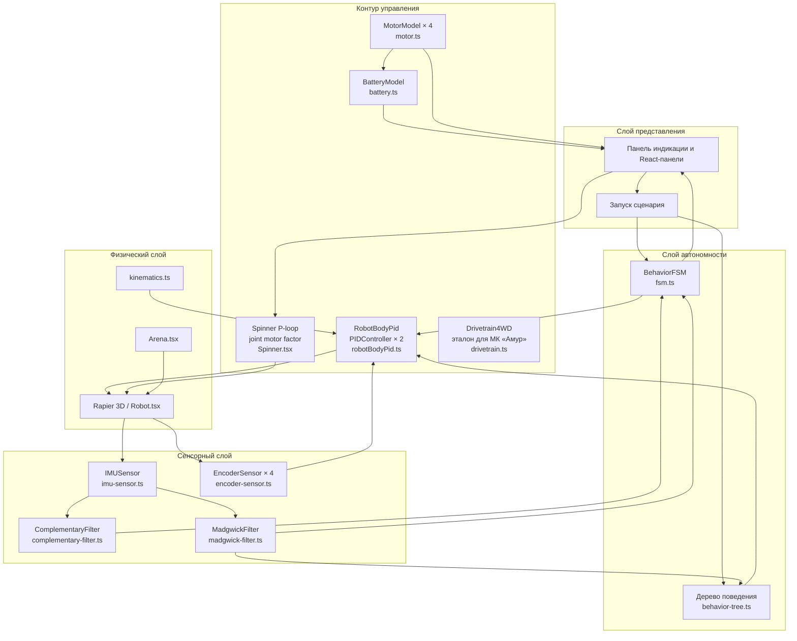

# Архитектура веб-симулятора 1T-REX

## 1. Назначение и место в работе

Симулятор является программно-инструментальной частью ВКР «Программирование интеллектуальных роботов» (Финансовый университет, кафедра прикладной информатики, 2026 г.). Он реализует цифровой двойник боевого робота 1T-REX (масса 110 кг, максимальная скорость 25 км/ч, вертикальный ротор с частотой вращения до 7000 об/мин, привод 4WD с одним мотором на колесо и редуктором с условным обозначением «8.3», два привода ротора с ремённой передачей, силовая АКБ 12S Li-Po на 44.4 В) в виде веб-приложения и используется для:

- отработки алгоритмов управления и автономности до их переноса на микроконтроллер МИК32 «Амур»;
- сбора экспериментальных данных по сценариям из главы «Программная реализация и экспериментальное исследование»;
- машинной проверки выполнения сценариев по JSON-протоколу трассировки и независимому верификатору;
- демонстрации работы при защите ВКР без необходимости физического запуска боевого образца.

## 2. Принципы декомпозиции

Архитектура построена по принципу разделения ответственностей, аналогичному классической HAL-структуре встраиваемых систем: каждый верхний слой использует только публичный интерфейс нижестоящего и не знает о деталях его реализации. Такое разделение позволяет переносить контроллерные модули ([pid.ts](../src/control/pid.ts), [motor.ts](../src/control/motor.ts), [battery.ts](../src/control/battery.ts), [drivetrain.ts](../src/control/drivetrain.ts), [fsm.ts](../src/autonomy/fsm.ts), сенсорные фильтры) непосредственно в C/C++-прошивку без переписывания логики, а в симуляторе — подменять физический движок на стенд с реальным оборудованием.

Слои сверху вниз:

1. **Панель индикации и пользовательский интерфейс** — React-компоненты в `src/hud/`, отрисовка телеметрии, графиков, переключение сценариев.
2. **Слой автономности** — [fsm.ts](../src/autonomy/fsm.ts) и [behavior-tree.ts](../src/autonomy/behavior-tree.ts), описывает поведение робота как конечный автомат и дерево поведения. `BehaviorFSM` создаётся внутри [ScenarioRunner](../src/scenarios/ScenarioRunner.ts) и тикается каждым физическим шагом миссии: `rangeMeters` собирается из опционального хука `Scenario.targetForFsm`, а флаг `managesFsmState=true` (например, в эксперименте `fsmVsBt`) отдаёт управление автоматом самому сценарию.
3. **Контур управления** — ПИД-регуляторы скоростей корпуса (linear + angular) на body level в [robotBodyPid.ts](../src/physics/robotBodyPid.ts), P-контур ротора с динамическим joint motor factor в [Spinner.tsx](../src/physics/Spinner.tsx), модели мотора, АКБ и эталонный 4WD-стек для прошивки ([pid.ts](../src/control/pid.ts), [motor.ts](../src/control/motor.ts), [battery.ts](../src/control/battery.ts), [drivetrain.ts](../src/control/drivetrain.ts)).
4. **Сенсорный слой** — виртуальные датчики и фильтры оценки состояния ([imu-sensor.ts](../src/sensors/imu-sensor.ts), [encoder-sensor.ts](../src/sensors/encoder-sensor.ts), [complementary-filter.ts](../src/sensors/complementary-filter.ts), [madgwick-filter.ts](../src/sensors/madgwick-filter.ts)).
5. **Физический слой** — кинематика бортового поворота ([kinematics.ts](../src/physics/kinematics.ts)), rolling-модель колёс ([wheelRolling.ts](../src/physics/wheelRolling.ts)), гибридная кинематическая интеграция Rapier через [Robot.tsx](../src/physics/Robot.tsx), guard от fixed-препятствий [useKinematicObstacleController.ts](../src/physics/useKinematicObstacleController.ts), четырёхзонная сцена [Arena.tsx](../src/physics/Arena.tsx) и преследующая камера [FollowCamera.tsx](../src/physics/FollowCamera.tsx).
6. **Сценарии и тесты** — `src/scenarios/`, четыре миссии, три сравнительных эксперимента, [verification.ts](../src/scenarios/verification.ts) + checks в `src/scenarios/verification/`, юнит-тесты `*.test.ts` и сквозные тесты `e2e/`.

## 3. Граф компонентов



Связи на диаграмме читаются как «компонент A потребляет публичный интерфейс компонента B». Компоненты одного уровня (например, четыре экземпляра `MotorModel`) объединены в общий блок. Блок `Drivetrain4WD` показан отдельно от активного контура управления — он сохранён как эталонная per-wheel сборка PID + MotorModel × 4 для прямого переноса на прошивку МИК32 «Амур», где ESC управляет каждым колесом независимо. В симуляторе с kinematic-position шасси активный контур работает на уровне скоростей корпуса (`RobotBodyPid`), а энергопотребление считается через `MotorModel × 4` напрямую в [robotPower.ts](../src/physics/robotPower.ts).

## 4. Поток данных за один шаг физики

Шаг симуляции — фиксированный, dt ≈ 1/60 с (синхронизирован с фреймом Rapier и `requestAnimationFrame`). На каждом шаге выполняется детерминированная последовательность вызовов, изображённая ниже.

```mermaid
sequenceDiagram
    autonumber
    participant Loop as Главный цикл (Robot.tsx)
    participant Rap as Rapier (kinematic chassis)
    participant Enc as EncoderSensor
    participant Imu as IMUSensor
    participant Comp as Complementary / Madgwick
    participant Fsm as BehaviorFSM
    participant Bpid as RobotBodyPid (lin/ang)
    participant Mot as MotorModel × 4
    participant Bat as BatteryModel
    participant Spin as Spinner (joint motor)

    Loop->>Rap: запросить позу и rolling ω_i
    Rap-->>Loop: истинные v, ψdot, rolling ω_i (ground truth)
    Loop->>Enc: step(ω_i, dt)
    Enc-->>Loop: измеренные ω̂_i (квантованные)
    Loop->>Imu: sample(a, ω, dt)
    Imu-->>Loop: ã, ω̃ (с шумом и bias-дрифтом)
    Loop->>Comp: update(ã, ω̃, dt)
    Comp-->>Loop: roll, pitch
    Loop->>Fsm: step(tick, ctx={range, soc, flipped, …})
    Fsm-->>Loop: state ∈ {IDLE, SEARCH, ENGAGE, RECOVERY}
    Loop->>Bpid: setGains(drivePid); step(v_target, ψdot_target, v, ψdot, dt)
    Bpid-->>Loop: новое v, ψdot (после асимметричного clamp ускорения)
    Loop->>Rap: setNextKinematicTranslation/Rotation после obstacle clamp
    Loop->>Mot: step(duty_i ≈ ω_target_i/ω_max, ω̂_i, dt) → I_i
    Loop->>Bat: step(Σ|I_i| + AUX + I_spinner, dt) → V_load, SOC
    Bat-->>Loop: V_load (брается следующим тиком для brownoutScale)
    Spin->>Rap: configureMotorVelocity(ω_spin_target, F(K_p, K_i, K_d))
```

Ключевые свойства потока:

- **Однонаправленность.** Истинные значения движутся от Rapier к фильтрам, оценки — к управлению, управляющее задание — обратно в Rapier. Шасси остаётся `kinematicPosition`: скорость интегрируется явно, поза задаётся через `setNextKinematicTranslation/Rotation`, а `useKinematicObstacleController` зажимает движение и запрещает yaw-позу, если cuboid шасси пересёк fixed non-sensor collider. Ограничение описано в [assumptions.md](./assumptions.md).
- **Rolling-визуал колёс.** Колёса остаются отдельными rigid bodies для коллайдеров и GLB-моделей, но их видимый угол вращения интегрируется из фактической дельты позы корпуса после всех clamp-проверок. Поэтому удержанный газ в стену оставляет `wheelOmegaTarget` ненулевым, но `wheelOmega` и визуальное вращение равны нулю, если шасси не движется.
- **Детерминированность.** При фиксированном seed ГПСЧ датчиков/сценариев и одинаковом dt последовательность состояний повторяема, что важно для отчётных таблиц в [experiments.md](./experiments.md). Сценарий `searchAndStrike` получает старт цели от seed, а не от системного времени.
- **Проверочный шлюз сценариев.** По завершении ScenarioRunner вызывает [verifyScenarioLog](../src/scenarios/verification.ts), а Node-скрипты используют тот же набор инвариантов. Проверка читает скачиваемый JSON-протокол и подтверждает не только `status`, но и физические признаки: активность пилотного контура, отклик команды, покрытие траектории, порядок прохождения obstacle-коридора, контакт с целью, раскрутку/удар ротором, информативный yaw-прогон и метрики напряжения.
- **Изоляция тестов.** Каждый модуль контура имеет соответствующий `*.test.ts` и тестируется без участия Rapier: [pid.test.ts](../src/control/pid.test.ts), [motor.test.ts](../src/control/motor.test.ts), [battery.test.ts](../src/control/battery.test.ts), [drivetrain.test.ts](../src/control/drivetrain.test.ts), [kinematics.test.ts](../src/physics/kinematics.test.ts), [complementary-filter.test.ts](../src/sensors/complementary-filter.test.ts), [madgwick-filter.test.ts](../src/sensors/madgwick-filter.test.ts), [imu-sensor.test.ts](../src/sensors/imu-sensor.test.ts), [encoder-sensor.test.ts](../src/sensors/encoder-sensor.test.ts), [fsm.test.ts](../src/autonomy/fsm.test.ts).

## 5. Соответствие модулей и разделов ВКР

| Раздел ВКР | Модуль | Файл |
|---|---|---|
| §2.1 | Архитектура, поток данных, модели привода, АКБ, сенсоров и фильтров | [architecture.md](./architecture.md), [models.md](./models.md), `src/control/`, `src/sensors/` |
| §2.2 | ПИД, 4WD-кинематика, FSM, дерево поведения | [pid.ts](../src/control/pid.ts), [kinematics.ts](../src/physics/kinematics.ts), [fsm.ts](../src/autonomy/fsm.ts), [behavior-tree.ts](../src/autonomy/behavior-tree.ts) |
| §3.1 | Сценарии, JSON-протоколы трассировки, `summary` и проверочный шлюз | [manager.ts](../src/scenarios/manager.ts), [verification.ts](../src/scenarios/verification.ts), `src/scenarios/verification/`, `src/scenarios/*.tsx` |
| §3.2 | Доверие к модели и симуляции, допущения, долг валидации | [ms-credibility.md](./ms-credibility.md), [assumptions.md](./assumptions.md) |

## 6. Технологический стек

- TypeScript строго-типизированный, ES2022 модули.
- React 19 + react-three-fiber для отрисовки 3D-сцены.
- Rapier (rapier3d-compat) — физический движок твёрдых тел.
- Tailwind 4 + локальные HUD-компоненты — оформление панели индикации в фирменной фиолетово-розовой палитре 1T-REX.
- Vitest — модульное тестирование контурных и сенсорных модулей.
- Vite — сборка и dev-сервер.

## 7. Устройство арены

Арена разделена на четыре цветовые зоны, размещённые по квадрантам вокруг свободного центра:

| Зона | Квадрант | Палитра | Назначение | Физическая модель |
|---|---|---|---|---|
| A | северо-запад | красная | шредер, наносящий урон роботу | kinematic-position ротор с твёрдыми colliders лопастей/ступицы + sensor/proximity damage с учётом footprint робота; увеличивает `telemetry.arenaDamage`, не превращая всю зону в невидимую стену |
| B | северо-восток | оранжевая | коробки, которым робот может наносить урон | dynamic crates с локальным health, `ccd`, damping и удалением после повреждений |
| C | юго-запад | зелёная | крытый гараж для въезда/выезда | fixed floor, стены, стойки, полупрозрачная крыша, открытый въезд со стороны центра |
| D | юго-восток | серо-металлическая | мост с въездом, проездом и съездом | fixed deck + клиновидные ramp-плиты с ConvexHullCollider + боковые рейки |

Реализация следует актуальной для Rapier схеме: архитектура и вертикальные элементы — fixed rigid bodies с простыми `CuboidCollider`; въезды A/B/C/D и мостовые пандусы — выпуклые клинья с `ConvexHullCollider`, чтобы визуальный скос совпадал с физическим контактом. Интерактивные коробки — dynamic rigid bodies. Опасная зона A сочетает kinematic-position ротор с реальными colliders лопастей/ступицы, sensor-зону и proximity-диск, чтобы робот не проходил сквозь шредер, но и не упирался в большую невидимую коробку. Кинематическое шасси дополнительно проверяет fixed non-sensor препятствия перед translation/yaw, поэтому исправление проходимости рамп не возвращает старый дефект «робот проходит сквозь объекты».

## 8. Воспроизводимость экспериментальных данных

Сценарии пишут JSON-лог с шагом около 100 мс через [ScenarioRunner](../src/scenarios/manager.ts) и [scenario-store.ts](../src/store/scenario-store.ts). В метаданных сохраняются `schemaVersion`, `appVersion`, `modelVersion`, `scenarioId` и `seed`; в каждой записи — координаты, скорость, yaw/yawRate, состояние FSM, метрика сценария, SOC АКБ, напряжение под нагрузкой, ток АКБ, температуры АКБ и ходовых моторов, обороты ротора, оценки фильтра ориентации и `arenaDamage`.

Быстрая сводка по одному или нескольким выгруженным логам строится командой:

```bash
npm run scenario:analyze -- path/to/1trex-figureEight.json
```

Скрипт [analyze-scenario-log.mjs](../scripts/analyze-scenario-log.mjs) не заменяет полную обработку главы 4, но закрывает обязательную трассируемость: каждая табличная метрика в [experiments.md](./experiments.md) имеет источник в экспортированном логе, а численные значения можно пересчитать без доступа к браузеру.

Критерии доверия к модели и оставшийся долг валидации вынесены в [ms-credibility.md](./ms-credibility.md). Проект использует рамку NASA-7009 для проверки и оценки доверия, но не заявляет внешнюю сертификацию без физических данных и независимой экспертизы.

## 9. Доступность операторской панели

Основная панель индикации проверяется автоматическим axe-аудитом в Playwright (`npx playwright test`) по WCAG A/AA. Интерактивные элементы имеют машинно читаемые имена: выбор сценария связан с подписью, кнопки режимов используют `aria-pressed`, вкладки реализуют tablist/tab/tabpanel и поддерживают клавиатурные `ArrowLeft`, `ArrowRight`, `Home`, `End`. Правую панель можно скрыть; в свернутом состоянии остаётся кнопка возврата панели.

## 10. Перенос на МИК32 «Амур»

Все модули из `src/control/`, `src/sensors/` и `src/autonomy/` спроектированы как чистые TypeScript-классы без зависимостей от DOM, React и Rapier. Их прямой перенос на C/C++-прошивку МИК32 требует только:

1. замены `number` на `float` и при необходимости фиксированной точки;
2. подстановки реальных вызовов HAL вместо вызовов виртуальных датчиков;
3. сохранения структуры и имён переходов FSM (это явно зафиксировано в комментариях [fsm.ts](../src/autonomy/fsm.ts) и [pid.ts](../src/control/pid.ts) как требование совместимости с прошивкой).

Граница между «переносимой» и «симуляторной» частями проходит ровно по слою физики: всё, что выше [kinematics.ts](../src/physics/kinematics.ts), переносимо, всё, что ниже (Rapier, Three.js, панель индикации), — относится исключительно к симулятору.
